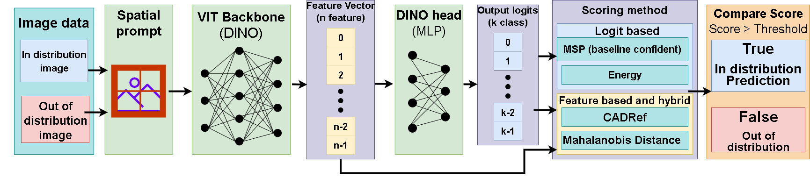

# OOD-SPTNet: a modified Spacial prompt tuning with ViT backbone for Out-of-distribution task

<p align="center">
    Inspired by the original framework from: 
    <a href="https://arxiv.org/abs/2403.13684"></a>
    <a href="https://visual-ai.github.io/sptnet/"></a>
    <a href="https://huggingface.co/whj363636/SPTNet"></a>
    <a href="#jump"></a>
</p>

## Pipeline



## Running
If you wish to run our model then please follow this step for our project to run probably. firstly, make a new folder called ```checkpoints``` and ```dataset``` at the root folder. This will create a folder to save the trained model after a certain epoch storage all the dataset used in this model. First, please modify all the directions in the ```config.py``` file to the correct direction. 

Then, please modify all the directions in the ```config.py``` file to the correct direction if you changed them. 

After that please check out our dataset and checkpoint folder in [Google Drive](https://drive.google.com/drive/folders/198gPIeNmm9-cfFFva3vYcM50tJ-KV7of?usp=drive_link), This is where we store some of our OOD dataset that have to be downloaded manually (Cifar 10/100, SVHN and DTD is downloaded automaticly if not exist in the model yet) and the checkpoints are our trained model that can be used for evaluating or train further for more epoch.

### Evaluate
If you want to test model performance you can you these following script
```
python eval.py \
    --dataset_name cifar10 \
    --ood_dataset svhn \
    --pretrained_model_path ./checkpoints/cifar10/BB_view2_CMS/epoch_20.pt \
    --prompt_type all \
    --use_bb True\
    --eval_funcs v2
```
Note that base on what model you want to train, you can change that model path by modify the ```pretrained_model_path``` argument. 

In addtion, you can also change the ID dataset and OOD dataset by change the ```dataset_name``` and ```ood_dataset``` argument respectively.

Lastly, you need to change the ```use_bb``` base on the architect you used, True if Backbone and False if Bottleneck. Note that if you use one of our checkpoint folder, use can see that the in the name of the child folder of ```Cifar10```, the 2 first letter indicate what achitecture it is using, BB is Backbone and BN if Bottleneck.

### Training
If you wish to train our model, you can use our folllowing script
```
python train_spt.py \
    --dataset_name cifar100 \
    --batch_size 128 \
    --grad_from_block 11 \
    --epochs 20 \
    --num_workers 2 \
    --use_ssb_splits \
    --sup_weight 0.35 \
    --weight_decay 5e-4 \
    --transform imagenet \
    --n_views 2\
    --lr 1 \
    --lr2 0.05 \
    --prompt_size 1 \
    --freq_rep_learn 20 \
    --pretrained_model_path ./pretrained_models/dino/dino_deitsmall16_pretrain.pth \
    --prompt_type all \
    --eval_funcs v2 \
    --warmup_teacher_temp 0.07 \
    --teacher_temp 0.04 \
    --ood_threshold -1\
    --warmup_teacher_temp_epochs 10 \
    --memax_weight 1 \
    --eval_freq 20 \
    --use_margin True \
    --use_supconloss True \
    --use_bb False \
    --model_path ./checkpoints/cifar100/BN_view2_CMS \
    --model_name epoch_40.pt
```
If you want to train from scrap, you can use our the default path in the ```pretrained_model_path``` argument or change it to your pretrain ViT backbone. If you want to continue from our checkpoint, please add a new argument called ```use_checkpoint``` and set it to True.

Change the ```use_margin```, ```use_supconloss```, ```use_bb```, ```n_views``` base on the setting of your  that currently used to train.

Change the ```model_path``` and ```model_name``` base on where you want to store the parameter of the trained model and its name.
